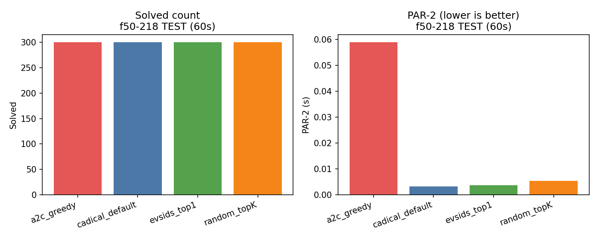
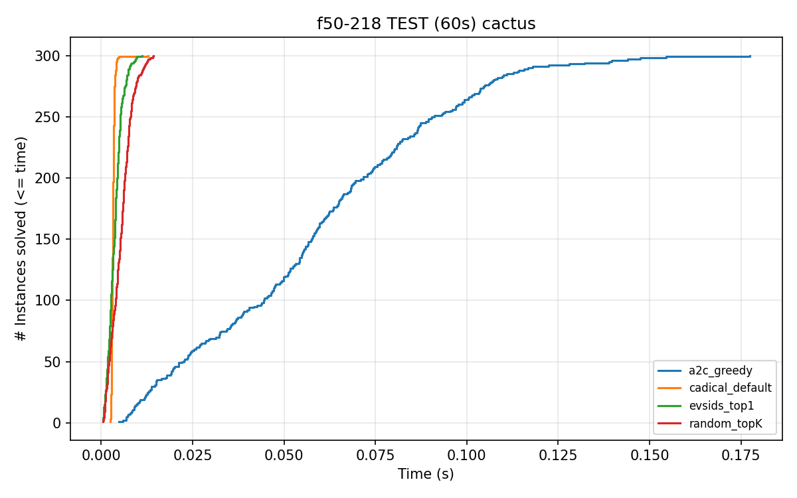
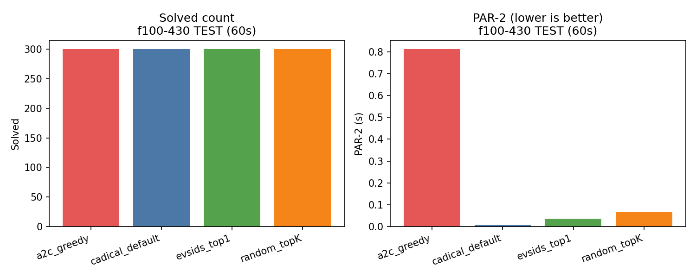
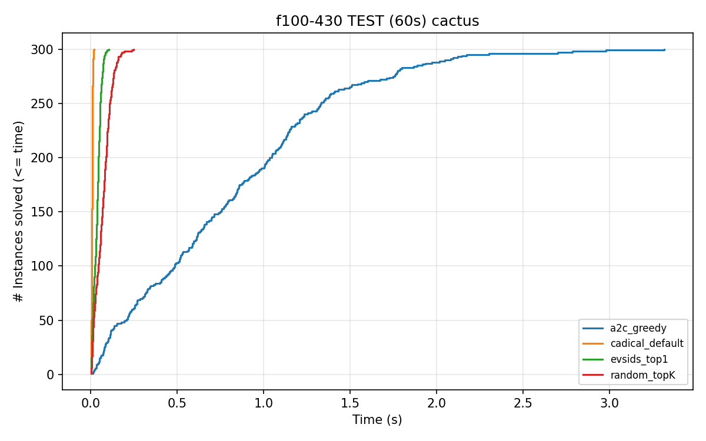
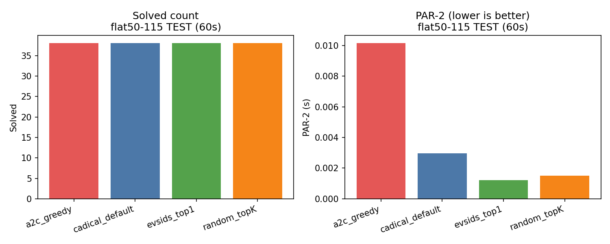
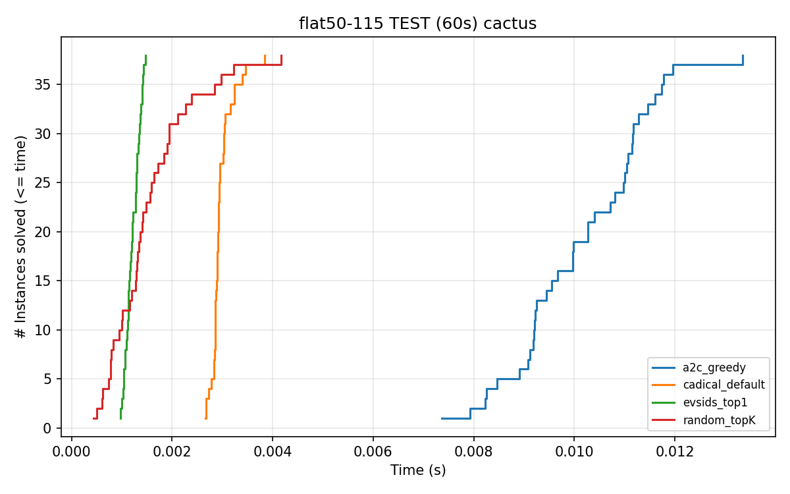

# CaDiCaL RL — Learning Branching Policies for SAT (Boolean Satisfiability)

_Reinforcement‑learning (RL) variable selection controller for the CaDiCaL SAT solver._  
We instrument CaDiCaL with a **minimal, high‑throughput control surface**, bridge it to Python via **pybind11**, and train an **A2C** policy that selects the next decision variable from a **top‑K** EVSIDS candidate menu. The repo includes the instrumented solver, bridge, environment, model, training loop, baselines, and **fully reproducible** evaluation scripts that produce **bar** and **cactus** plots + CSV tables for three SAT families.

> Families covered: **f50‑218**, **f100‑430**, **flat50‑115** (train/val/test splits under `data/instances/`).

---

## ✨ Highlights

- **Minimal RL hook inside CaDiCaL**: decision override + **top‑K EVSIDS snapshot** at decision points.
- **Fast pybind11 bridge**: `satrl_bridge` with `load_dimacs(...)`, `solve_until_next_hook(K, timeout_ms)`, `apply_action(idx, M)`, `get_metrics()`.
- **Python environment** (`env/`): compact observations (global=11, candidate=5 features), mask, and reward shaping (Δ window PPD, Δ mean LBD + terminal bonus).
- **Candidate‑aware A2C** (actor–critic with GAE(λ), entropy anneal, grad‑clip) implemented in `rl/`.
- **One‑command baselines & evaluation** in `scripts/`; auto‑generates PNG figures and CSV tables in `results/`.

---

## 📦 Repository Layout (top‑level)

- `bridge/`
- `cadical/`
- `cfg/`
- `data/`
- `env/`
- `logs/`
- `results/`
- `rl/`
- `scripts/`
- `tests/`
- `.gitignore`
- `README.md`
- `commands.md`
- `implementation.txt`
- `requirements.txt`
- `training_pipeline.txt`

---

## ⚙️ Build

```bash
# 1) Python env
python3 -m venv .venv && . .venv/bin/activate
pip install -U pip && pip install -r requirements.txt

# 2) Build CaDiCaL (static lib + app)
cmake -S cadical -B cadical/build -DCMAKE_BUILD_TYPE=Release -DCMAKE_POSITION_INDEPENDENT_CODE=ON
cmake --build cadical/build -j

# 3) Build the pybind bridge for THIS Python
cmake -S bridge -B bridge/build -DCMAKE_BUILD_TYPE=Release \
  -DPython3_EXECUTABLE="$(python3 -c 'import sys; print(sys.executable)')"
cmake --build bridge/build -j
```

---

## 🚀 Quickstart

**Train (single‑seed config):**
```bash
# create a seed config (seed=0)
python - <<'PY'
import yaml, shutil
cfg = yaml.safe_load(open('cfg/a2c.yaml'))
cfg['seed'] = 0
open('cfg/seed0.yaml','w').write(yaml.safe_dump(cfg))
PY

# Stage A — uf50‑218 (SAT‑only), e.g. 50k updates
python scripts/train_a2c.py --cfg cfg/seed0.yaml --split train --family 'f50-218/uf'   --max-updates 50000 --logdir logs/gae_lbd_stageA_seed0

# Stage B — f50‑218 (SAT/UNSAT), warm‑start from Stage A
python scripts/train_a2c.py --cfg cfg/seed0.yaml --split train --family 'f50-218'   --max-updates 50000 --logdir logs/gae_lbd_stageB_seed0 --init-ckpt logs/gae_lbd_stageA_seed0/ckpt.pt

# Stage C — f100‑430 (SAT/UNSAT), warm‑start from Stage B; longer rollouts
python - <<'PY'
import yaml
cfg=yaml.safe_load(open('cfg/seed0.yaml')); cfg['rollout_T']=64
open('cfg/seed0_t64.yaml','w').write(yaml.safe_dump(cfg))
PY
python scripts/train_a2c.py --cfg cfg/seed0_t64.yaml --split train --family 'f100-430'   --max-updates 50000 --logdir logs/gae_lbd_stageC_seed0 --init-ckpt logs/gae_lbd_stageB_seed0/ckpt.pt

# (Optional) curves + summaries
python scripts/plot_training_curves.py logs/gae_lbd_stageA_seed0/train.jsonl
python scripts/save_training_summary.py logs/gae_lbd_stageA_seed0/train.jsonl --out logs/gae_lbd_stageA_seed0/summary.json
```

**Evaluate (TEST, 60s, K=16, M=8):**
```bash
# Baselines
python scripts/run_baselines.py --split test --family f50-218  --timeout_s 60 --K 16 --M 8 --out results/f50-218/test-baselines-60s.gae_lbd.jsonl
python scripts/run_baselines.py --split test --family f100-430 --timeout_s 60 --K 16 --M 8 --out results/f100-430/test-baselines-60s.gae_lbd.jsonl
python scripts/run_baselines.py --split test --family flat50-115 --timeout_s 60 --K 16 --M 8 --out results/flat50-115/test-baselines-60s.gae_lbd.jsonl

# A2C (greedy) — family‑appropriate checkpoints
python scripts/eval_a2c.py --split test --family f50-218   --ckpt logs/gae_lbd_stageB_seed0/ckpt.pt --timeout_s 60 --K 16 --M 8 --mode greedy --out results/f50-218/test-a2c-60s.greedy.gae_lbd.jsonl
python scripts/eval_a2c.py --split test --family f100-430  --ckpt logs/gae_lbd_stageC_seed0/ckpt.pt --timeout_s 60 --K 16 --M 8 --mode greedy --out results/f100-430/test-a2c-60s.greedy.gae_lbd.jsonl
python scripts/eval_a2c.py --split test --family flat50-115 --ckpt logs/gae_lbd_stageB_seed0/ckpt.pt --timeout_s 60 --K 16 --M 8 --mode greedy --out results/flat50-115/test-a2c-60s.greedy.gae_lbd.jsonl

# Plots + table
python scripts/plot_eval_vs_baselines.py --baselines results/f50-218/test-baselines-60s.gae_lbd.jsonl  --eval results/f50-218/test-a2c-60s.greedy.gae_lbd.jsonl  --out results/f50-218/test-bars.png       --title "f50-218 TEST (60s)"
python scripts/plot_cactus.py           --in        results/f50-218/test-baselines-60s.gae_lbd.jsonl,results/f50-218/test-a2c-60s.greedy.gae_lbd.jsonl --out results/f50-218/test-cactus.png     --title "f50-218 TEST (60s) cactus"
python scripts/make_tables.py           --in        results/f50-218/test-baselines-60s.gae_lbd.jsonl,results/f50-218/test-a2c-60s.greedy.gae_lbd.jsonl --out results/f50-218/test-table.csv

# (Repeat 3 lines for f100-430 and flat50-115)
```

---

## 📊 Results (TEST, 60s budget)

_All methods solve 100% of instances across all three families. On these easy/medium benchmarks, baseline CaDiCaL heuristics are faster in wall‑clock; A2C serves as a proof‑of‑concept of a clean, reproducible learning pipeline._

### f50‑218



| algo | n | solved | solved % | median (s) | PAR-2 (s) |
|---|---:|---:|---:|---:|---:|
| a2c_greedy | 300 | 300 | 100.000000 | 0.057560 | 0.058880 |
| cadical_default | 300 | 300 | 100.000000 | 0.003143 | 0.003222 |
| evsids_top1 | 300 | 300 | 100.000000 | 0.003601 | 0.003683 |
| random_topK | 300 | 300 | 100.000000 | 0.005263 | 0.005334 |


### f100‑430



| algo | n | solved | solved % | median (s) | PAR-2 (s) |
|---|---:|---:|---:|---:|---:|
| a2c_greedy | 300 | 300 | 100.000000 | 0.750953 | 0.811869 |
| cadical_default | 300 | 300 | 100.000000 | 0.007706 | 0.007719 |
| evsids_top1 | 300 | 300 | 100.000000 | 0.036239 | 0.035654 |
| random_topK | 300 | 300 | 100.000000 | 0.066942 | 0.068704 |


### flat50‑115



| algo | n | solved | solved % | median (s) | PAR-2 (s) |
|---|---:|---:|---:|---:|---:|
| a2c_greedy | 38 | 38 | 100.000000 | 0.010124 | 0.010138 |
| cadical_default | 38 | 38 | 100.000000 | 0.002917 | 0.002966 |
| evsids_top1 | 38 | 38 | 100.000000 | 0.001202 | 0.001211 |
| random_topK | 38 | 38 | 100.000000 | 0.001358 | 0.001519 |


**Relative to `cadical_default` (PAR‑2):**  

**f50-218**

| algo | PAR-2 (s) | × vs cadical_default |
|---|---:|---:|
| a2c_greedy | 0.058880 | 18.27× |
| cadical_default | 0.003222 | 1.00× |
| evsids_top1 | 0.003683 | 1.14× |
| random_topK | 0.005334 | 1.66× |

**f100-430**

| algo | PAR-2 (s) | × vs cadical_default |
|---|---:|---:|
| a2c_greedy | 0.811869 | 105.18× |
| cadical_default | 0.007719 | 1.00× |
| evsids_top1 | 0.035654 | 4.62× |
| random_topK | 0.068704 | 8.90× |

**flat50-115**

| algo | PAR-2 (s) | × vs cadical_default |
|---|---:|---:|
| a2c_greedy | 0.010138 | 3.42× |
| cadical_default | 0.002966 | 1.00× |
| evsids_top1 | 0.001211 | 0.41× |
| random_topK | 0.001519 | 0.51× |


> Source CSVs are in `results/<family>/test-table.csv`. JSONL logs for both baselines and A2C are also provided alongside the figures.

---

## 🧠 How it Works (high‑level)

**Inside CaDiCaL (C++)**
- At each decision boundary, we capture a **top‑K** EVSIDS candidate list (skip assigned/inactive) and a compact **global** feature vector.
- An external override (`rl_next_var`) can force the **next decision variable**. A window of size **M** enforces a sequence of decisions.
- Exposed via a small C++ API wrapped with **pybind11** (`satrl_bridge`).

**Bridge API (pybind11)**
```cpp
solver.reset();
solver.load_dimacs("<path>.cnf");
auto snap = solver.solve_until_next_hook(K /*e.g.,16*/, timeout_ms /*e.g.,5*/);
// -> snap["global"], snap["cands"], snap["status"], snap["done"]
solver.apply_action(/*idx in [0,K)*/, /*M*/);
auto metrics = solver.get_metrics(); // time_s, conflicts, decisions, props, meanLBD_*
```

**Python Env (`env/`)**
- Observation: `global: [11]`, `cands: [K, 5]`, `mask: [K]` where `cands[i] = [var, evsids, rank, ...]`.
- Reward: Δ(window) **propagations/decision** + Δ(mean **LBD**) + terminal bonus (+10 solved, −10 timeout).
- Episode limits: configurable wall‑clock seconds and/or conflict caps.

**Policy (`rl/models/a2c.py`)**
- Candidate‑aware logits from `[cand_embed, global_embed]` (shared head over K candidates).
- Value head pools candidate context (**mean + max**) + global.
- Training: A2C with **GAE(λ=0.95)**, entropy annealing (0.02→0), **grad‑clip 0.7**, Adam (lr=3e‑4).

---

## 🔁 Reproducibility

- All commands are scripted under `scripts/` and a consolidated cookbook is in **`commands.md`**.
- Deterministic seeds for both NumPy and PyTorch (see `cfg/*.yaml`).
- Evaluation emits JSONL logs + deterministic CSV summaries and figure PNGs.

---

## ⚠️ Limitations & Next Steps

- **Overhead on trivial instances**: Python/ML inference adds latency; consider larger **M**, compiled policies (`torch.compile`/TorchScript), or GPU inference.
- **Scale up training**: longer rollouts, more updates, multi‑seed selection; explore alternative rewards that align even better with solver time.
- **Beyond A2C**: PPO or supervised imitation as stronger starting points; richer features.

---

## 🙏 Acknowledgements

- [CaDiCaL](https://github.com/arminbiere/cadical) SAT solver by Armin Biere.
- PyTorch and the open‑source RL community for tooling and references.

---

## 📜 License

This repository and its contents were developed as part of the **COS700 Honours Research Project** at the **University of Pretoria**, South Africa.

© 2025 Ruan Carlinsky. All rights reserved.  
Use of this codebase is permitted for **academic and research purposes only**.  
For commercial or derivative use, please contact the author for permission.
